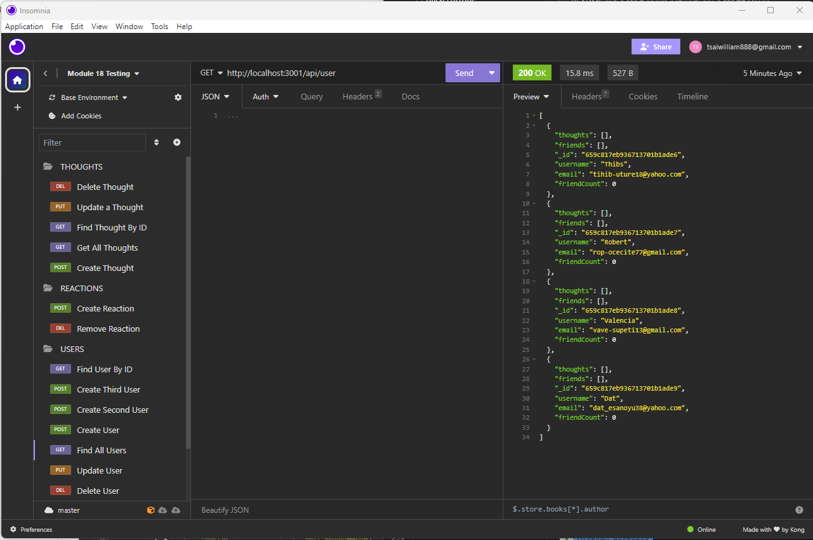

# social-network-api
## Description 

My motivation was to create a robust API integrated with a NoSQL database, specifically MongoDB. This API serves as the backbone of our social network platform, addressing the need to efficiently manage and store large volumes of unstructured data.

This project solves the challenge of handling large amounts of unstructured data in the context of a social networking website. By developing this API with MongoDB, we can ensure scalability, data integrity, user-friendly interactions, and comprehensive testing.

This project addresses the fundamental challenge of building a scalable and user-friendly social media platform by providing a reliable API that efficiently manages and processes unstructured data, enhancing the overall user experience.

## Video Demo URL

[Social Network API Demo Video](https://drive.google.com/file/d/1cI73xBpry7aviO9Z9lqNa_Q_iWROyrJR/view)

## Installation

Installed the program using npm init -y and npm i. Must also make sure that mongoose and express modules are installed. 

Run npm run seed to add seeded data, then npm run start to start the API.

## Usage

The following image shows the web application's appearance and functionality:

## Credits

N/A

## License

N/A

